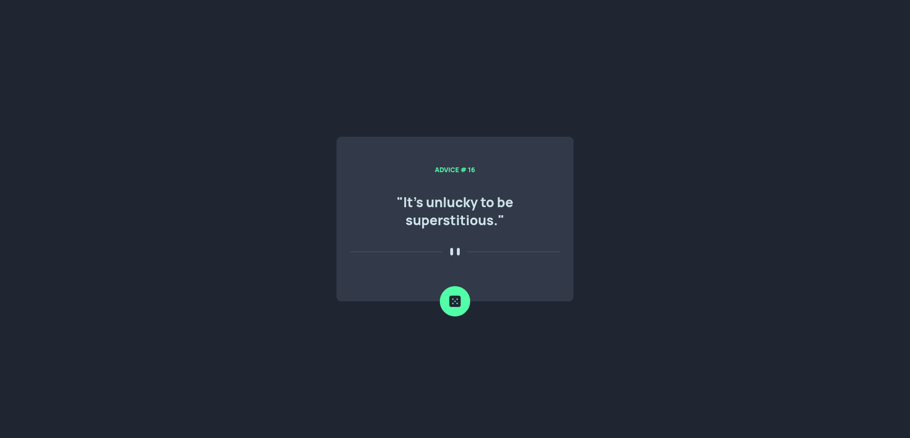

# Frontend Mentor - Advice generator app solution

This is a solution to the [Advice generator app challenge on Frontend Mentor](https://www.frontendmentor.io/challenges/advice-generator-app-QdUG-13db). Frontend Mentor challenges help you improve your coding skills by building realistic projects.

## Table of contents

- [Overview](#overview)
  - [The challenge](#the-challenge)
  - [Screenshot](#screenshot)
  - [Links](#links)
- [My process](#my-process)
  - [Built with](#built-with)
  - [What I learned](#what-i-learned)
  - [Continued development](#continued-development)
  - [Useful resources](#useful-resources)
- [Author](#author)
- [Acknowledgments](#acknowledgments)

**Note: Delete this note and update the table of contents based on what sections you keep.**

## Overview

### The challenge

Users should be able to:

- View the optimal layout for the app depending on their device's screen size
- See hover states for all interactive elements on the page
- Generate a new piece of advice by clicking the dice icon

### Screenshot



### Links

- Solution URL: [GITHUB](https://github.com/RadasinR/advice-generator-app.git)
- Live Site URL: [Live site](https://advice-generator-app-seven-zeta.vercel.app/)

## My process

### Built with

- Semantic HTML5 markup
- CSS custom properties
- Flexbox
- Mobile-first workflow

**Note: These are just examples. Delete this note and replace the list above with your own choices**

### What I learned
I this chaleng i learnd how to make http request with javascript.

```html
  <picture class="advice__sep">
    <source media="(min-width:1440px)" srcset="/images/pattern-divider-desktop.svg">
    
  </picture>
```
```css
.advice__sep {
    margin-bottom: calc(clamp(2rem, 10%, 6rem) - var(--gap) + var(--btn-size) / 2);
}
.btn--pos_advice {
    position: absolute;
    bottom: calc(var(--btn-size) / -2);
    left: calc(50% - var(--btn-size) / 2);
}
```
```js
  const URL = "https://api.adviceslip.com/advice";
    fetch(URL).then(res => {
        return res.json();
    }).then(advice => {
        console.log(advice);
        document.getElementById("adviceID").innerText = advice.slip.id;
        document.getElementById("adviceText").innerText = advice.slip.advice;
    })
```

### Useful resources

- [freecodecamp](https://www.freecodecamp.org/news/here-is-the-most-popular-ways-to-make-an-http-request-in-javascript-954ce8c95aaa/) - how to make http request with javascript
- [All possible ways of making an API call in JavaScript](https://levelup.gitconnected.com/all-possible-ways-of-making-an-api-call-in-plain-javascript-c0dee3c11b8b) - this was very helpfull


## Author

- Frontend Mentor - [Radasin](https://www.frontendmentor.io/profile/Radasin)

